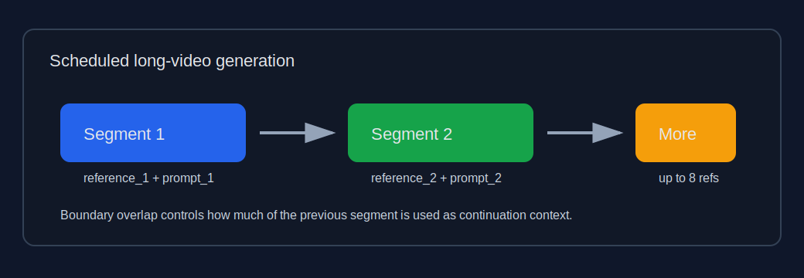
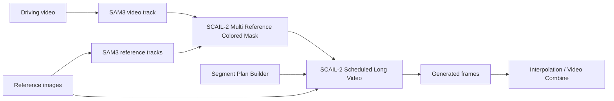
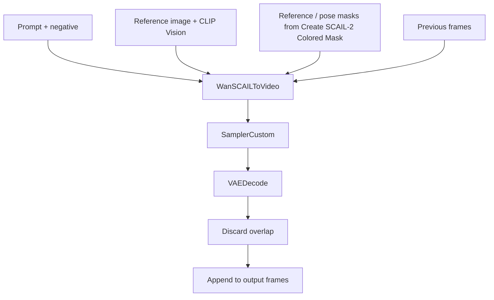

# ComfyUI SCAIL2 Scheduled Long Video

[中文说明](README.zh-CN.md)

Multi-reference, multi-prompt scheduling for ComfyUI SCAIL2 long-video workflows.

This custom node package wraps the native SCAIL2 long-video pattern into a cleaner scheduler:

- split a long video into planned segments;
- assign each segment its own prompt and reference image;
- keep native SCAIL2 chunking under the recommended 81-frame window;
- preserve continuation with `previous_frames`;
- optionally reduce cross-reference inertia with `boundary_overlap`;
- provide dynamic UI controls for segment and reference counts.



## Nodes

### SCAIL-2 Segment Plan Builder

Use this node to create a segment plan without hand-writing JSON.

Each segment has:

- `frames`: final frame count for this segment;
- `reference`: which `reference_N` image to use;
- `prompt`: positive prompt for the segment;
- `negative`: negative prompt for the segment;
- `boundary_overlap`: optional overlap override for the first chunk after a reference change.

Set `segment_count`, then click `Update segment inputs` to hide unused segment controls.

### SCAIL-2 Scheduled Long Video

Runs the scheduled generation by repeatedly calling native ComfyUI SCAIL2 nodes internally.

Set `reference_count`, then click `Update reference inputs` to hide unused `reference_N` inputs.
The same button also updates the matching `reference_N_mask` inputs.

Recommended replacement setup:

```text
driving_track_data + reference_N_track_data -> SCAIL-2 Multi Reference Colored Mask
                                            -> pose_video_mask + reference_N_mask
```

Connect one shared `pose_video_mask` to the scheduler and connect each segment
reference to its matching `reference_N_mask`. The scheduler does not run SAM
internally; person selection stays in upstream SAM tracking and the multi-mask
helper where it can be previewed.

The node also outputs `used_pose_video_mask` and `used_reference_mask_timeline`.
Both are aligned to the final generated frame timeline after chunk overlap is
discarded, so they can be previewed beside the generated video.

### SCAIL-2 Scheduled Long Video (Internal SAM)

Convenience version of the scheduler. It keeps the same segment/chunk/video
generation logic as `SCAIL-2 Scheduled Long Video`, but builds the masks inside
the node:

```text
pose_video + sam_model + sam_conditioning -> internal SAM3 driving track
reference_N + sam_model + sam_conditioning -> internal SAM3 reference tracks
tracks -> native SCAIL-2 colored masks -> scheduled long video generation
```

Use this node when you want a simpler workflow. Use the external-mask scheduler
when you want to preview or manually adjust SAM tracks/masks before generation.
In `animation` mode, the node skips internal SAM tracking because SCAIL
replacement masks are not used; `sam_model` and `sam_conditioning` are only
required for `replacement` mode.

The internal SAM node supports:

- `object_indices`: driving-video object indices after sorting;
- `reference_object_indices`: reference-image object indices, empty = all;
- `sort_by`: `none`, `left_to_right`, or `area`;
- SAM controls: detection threshold, max objects, detect interval.

For single-person reference images, keep `reference_object_indices` empty. If
you fill `object_indices = 1` to select the second person in the driving video
and the reference image only has one person, also filtering the reference by `1`
would make the reference mask empty.

### SCAIL-2 Face Detail Refinement

Adds a second-pass face refinement path without replacing either long-video
scheduler. The intended workflow is:

```text
SCAIL-2 Scheduled Long Video / Internal SAM.frames  # full-body pass
  -> SCAIL-2 Head Track Crop
  -> SCAIL-2 Scheduled Long Video / Internal SAM    # face crop pass
  -> SCAIL-2 Face Composite Back
  -> VHS_VideoCombine
```

`SCAIL-2 Head Track Crop` crops a stable square head video from the generated
full-body frames. Connect a `head_masks` MASK when available. If your ComfyUI
build exposes SAM3 tracking, you can instead connect `sam_model` and
`head_conditioning`. The node first tries to extract the SAM3 face/head mask from
that conditioned track data, then falls back only to ComfyUI nodes that output a
regular `MASK`. It does not use SCAIL colored-mask fallback for face detail
cropping, and it does not estimate a smaller head box from a larger body mask.
The SAM/input mask is treated as the source of truth: if it returns a face mask,
the crop follows the face; if it returns an upper-body mask, the crop will expose
that mask problem instead of hiding it.
The output `face_crop_video` is the square face-neighborhood crop. The output
`crop_masks` is the original face/head mask cropped into that square, without
inner bbox clipping. `crop_manifest.frames[].bbox` records the square's
full-body paste position, `crop_manifest.frames[].mask_bbox` records the mask
bbox used for crop placement, and `crop_manifest.frames[].detected_mask_bbox`
records the direct detected bbox when that frame had mask pixels. For full-body
9:16 videos, start with `crop_padding_ratio` around `0.35` to `0.5`.
Keep `square_align` at `32` for SCAIL-2 face-detail passes. The crop node keeps
the square side on that alignment even near the frame edge; for example, on a
720-wide source the largest aligned crop is 704, so the second SCAIL pass can
use the crop resolution exactly instead of silently flooring it from 720 to 704.
`mask_component_mode` defaults to `largest`, which keeps only the largest
connected mask region per frame before bbox calculation, so small body fragments
do not expand the crop canvas. Use `all` only when you need to inspect the raw
mask exactly as it came from SAM or the external mask input.

`crop_mode` controls how the square crop is placed:

- `center_follow`: keeps the crop size fixed from the first tracked frame, then
  follows the face center frame by frame.
- `fixed_canvas`: computes the smallest padded square that covers the tracked
  face/head region across the whole clip, then uses that same fixed full-body
  bbox for every frame. Use this when the second pass should refine a stable
  local camera region while the head moves inside it.

For the face crop pass, use either existing long-video scheduler:

- external-mask scheduler if you want to preview/adjust masks;
- internal-SAM scheduler if you want the crop video tracked inside the node.

Optional reference pre-alignment:

```text
SCAIL-2 Head Track Crop.face_crop_video + high-res face reference
  -> SCAIL-2 Align Reference Face To Crop
  -> aligned_reference_image
  -> face crop pass reference_N
```

Thanks to Aiwu (爱屋) for pointing out that the second-pass face-detail video is
more stable when the high-resolution reference face is aligned to the crop
video before generation. The `SCAIL-2 Align Reference Face To Crop` node was
added for that step: it matches the reference face position and face size to the
first selected crop frame while preserving as much original reference resolution
as possible.

`SCAIL-2 Align Reference Face To Crop` uses a face detector to compare the first
selected crop frame with the high-resolution reference image. It then builds a
new reference image whose aspect ratio matches the crop frame and whose face
position/face width matches the crop frame. The node does not shrink the
reference pixels to the crop resolution. It crops the reference at original
pixel density. By default, `window_fit_mode=shift_inside_reference` moves the
computed crop window back inside the reference image when that window can fit,
so a large enough reference image will not get artificial padding. Padding is
used only when the requested window is larger than the available reference
image, or when `window_fit_mode=strict_alignment` is selected to preserve exact
relative face placement. This keeps the reference as sharp as possible while
giving the second SCAIL pass a face reference whose layout already matches the
crop. Use `face_scale` only for intentional small corrections: values above
`1.0` make the reference face larger inside the output window, and values below
`1.0` make it smaller.

`face_detector_backend` defaults to `auto`. In auto mode the node tries
InsightFace first, then falls back to MediaPipe if InsightFace is not installed
or fails to load/detect a face. Use `insightface` when you want the strongest
detector and already have `insightface` plus `onnxruntime-gpu` installed. Use
`mediapipe` when you want the easiest install path:

```text
python -m pip install mediapipe
```

For InsightFace, install `insightface` plus `onnxruntime-gpu` for CUDA or
`onnxruntime` for CPU. The recommended model is `buffalo_l`; `buffalo_s` is
available when a smaller model is preferred. The MediaPipe backend uses the
built-in face detection solution, so it does not require a separate `.task`
model file.

Connect `face_crop_video` to the second scheduler's `pose_video`, and reuse the
same `segment_plan`, `max_chunk_frames`, `overlap_frames`, and
`boundary_overlap` settings as the full-body pass. Connect high-resolution face
references to `reference_N`; if the whole clip should use one face, point every
segment at reference `1`.

`SCAIL-2 Face Composite Back` pastes the refined crop back into the original
full-body frames using the crop manifest and mask. `color_correction` can be
enabled or disabled. When enabled, `local_mean_std` matches the refined face
crop to the target paste area before feather blending; when disabled, the node
only blends by mask. The node keeps `crop_masks` in the original crop canvas
recorded by the manifest, applies mask cleanup there, then fits the refined
face video back to that same crop canvas before blending and pasting the crop
back to the full-body frame. `face_fit_mode` controls how refined face frames
whose resolution changed are matched back to the manifest bbox: `center_crop`
keeps aspect ratio and crops the center, `pad` keeps aspect ratio and pads, and
`stretch` directly resizes to the bbox. The crop manifest also includes
CropAndStitch-style coordinate fields such as `crop_to_canvas_bbox` and
`canvas_to_original_bbox`; the composite node reads `crop_to_canvas_bbox` first
and falls back to the legacy `bbox` field for old workflows.

`frame_mismatch_mode` controls tail-frame mismatches between the full-body
video, refined face video, crop masks, and crop manifest. `trim_to_shortest`
is the default and trims all inputs to the shortest available frame count,
discarding extra trailing frames. `error` keeps the old strict validation.
For edge cleanup, `feather_px` blurs the stitch mask, `mask_contract_px` pulls
the mask edge inward, and `stitch_mask_expand_px` can grow it outward before
feathering. `stitch_mask_resize_mode` defaults to `bilinear` so soft feathered
masks stay soft when the refined crop is resized back to the original bbox;
`nearest` is available only for hard-mask debugging. `stitch_offset_x_px` and
`stitch_offset_y_px` apply a final pixel-level paste offset; use negative
`stitch_offset_x_px` if the pasted face appears a little too far right.

### SCAIL-2 Tile Upscale Pass

Adds a spatial tiling second pass for higher-resolution video generation. The
intended workflow is:

```text
first-pass SCAIL-2 frames
  -> SCAIL-2 Manual Tile Plan Builder
  -> SCAIL-2 Tiled Long Video / Tiled Long Video (Internal SAM)
  -> SCAIL-2 Head Track Crop
  -> SCAIL-2 Scheduled Long Video / Internal SAM    # face crop pass
  -> SCAIL-2 Face Composite Back
  -> VHS_VideoCombine
```

`SCAIL-2 Manual Tile Plan Builder` is the recommended creative workflow. It
adds a front-end editor with draggable tile rectangles. Move a rectangle to
reposition a tile, drag its lower-right handle to resize it, and use the editor
buttons to add/delete tiles, fill uncovered gaps, or reset to a 2x2 layout.
The editor highlights uncovered source areas and snaps tile edges to the canvas
or neighboring tile edges while moving/resizing. The Python node defaults to
`coverage_policy=auto_fill`, so gappy hand-written layouts are completed before
manifest generation unless you switch the policy to `error` or `ignore`.
The node then adds `overlap_ratio` around each selected core region and writes the same
`tile_manifest` consumed by `SCAIL-2 Tile Extractor`. The editor stores
normalized `layout_json.tiles`, so the layout survives workflow save/load.

The manual planner also accepts a `layout_json.tiles` array for non-2x2 layouts,
up to eight tiles. Each item can use normalized `{x0,y0,x1,y1}` or `{x,y,w,h}`.
This is the backend contract for a richer rectangle editor:

```json
{"tiles":[{"x0":0.0,"y0":0.0,"x1":0.62,"y1":0.55},{"x":0.45,"y":0.50,"w":0.55,"h":0.50}]}
```

Every tile is independently expanded by `overlap_ratio`; `tile_generate_size`
is snapped to `tile_align` using `resolution_snap_mode` (`nearest`, `ceil`, or
`floor`). This lets hand-drawn tiles have different aspect ratios while keeping
the repaint sizes on model-friendly 32-pixel steps.

Run the manual planner once to load preview frames into the editor. After it
executes, the front-end panel shows a video frame preview plus a frame slider;
adjust rectangles on a representative frame, then rerun the node to produce the
updated `tile_manifest`. The preview is only for choosing core tile rectangles.
Overlap, target crop boxes, and aligned generation sizes are still computed by
the Python node so downstream stitching remains deterministic.

`SCAIL-2 Tile Plan Builder` remains available for automatic planning. By
default both tile planners target a 2x final canvas, so a `548x960` first pass
composites back to `1096x1920`.
`overlap_ratio` expands each tile crop before the second pass, giving the model
context across tile boundaries. Because the overlap belongs to the generated
tile context, each tile's generation size can be larger than the core quadrant
and is aligned with `tile_align` for SCAIL/Wan-friendly dimensions.

Both tile planners output `tile_resolution_report` in addition to
`tile_manifest`. Use that report to configure each tile repaint pass. For every
tile it lists:

- `repaint_resolution`: the exact `width x height` to generate for that tile;
- `pixels`: total repaint pixels;
- `source_crop`: the first-pass crop size before upscaling;
- `target_crop`: the final-canvas paste size;
- `repaint_scale`: source crop -> tile repaint scale;
- `composite_scale`: tile repaint -> final-canvas paste scale.

`max_tile_pixels` defaults to `921600`, equivalent to a `1280x720` pixel
budget. With `enforce_tile_pixel_limit` enabled, the planner refuses to produce
a manifest if any tile's repaint resolution exceeds that budget. Resize or move
manual tile rectangles, lower `overlap_ratio`, lower `scale_factor`, or raise
`max_tile_pixels` before running the expensive repaint pass.

`SCAIL-2 Tiled Long Video` is the automated production node. Connect the
first-pass `pose_video`, `tile_manifest`, the original `segment_plan`, model
inputs, and the same references/reference masks used by `SCAIL-2 Scheduled Long
Video`. The node crops every tile internally, runs the scheduled long-video pass
once per tile, collects the actual output sizes, recomputes each tile's real
scale, and composites the tiles back to `tile_manifest.target_size`.

`SCAIL-2 Tiled Long Video (Internal SAM)` follows the same contract, but only
runs SAM once on the full first-pass video and full reference images. It then
crops the resulting global pose/reference masks per tile before each internal
long-video repaint. This keeps object ordering and mask identity consistent
across tile boundaries while avoiding repeated SAM tracking for every tile.

For manual debugging, you can still run each tile repaint pass as separate
nodes. After those tile repaint passes finish, use `SCAIL-2 Tile Repaint
Collector` before compositing. It reads the actual generated video dimensions,
recomputes the real source-crop -> repaint and repaint -> final-canvas scale for
each tile, and outputs `actual_tile_manifest`. Connect that manifest to
`SCAIL-2 Tile Composite Video.tile_manifest`. This handles cases where each tile
comes back at a different valid resolution, as long as the collector's pixel and
aspect checks pass.

`SCAIL-2 Tile Repaint Collector` and `SCAIL-2 Tile Composite Video` support up
to eight tile video inputs. Connect only the tile slots present in the manifest.
These standalone nodes remain useful for debugging or manually replacing a
single tile pass; the tiled long-video nodes perform the same collection and
composite steps internally for normal production workflows.

For people videos, connect a face/head/person mask to
`Tile Plan Builder.protected_masks`. The planner treats that mask as a protected
region, pads it with `protected_padding_ratio` and `protected_padding_px`, then
moves the 2x2 split lines away from it when possible. This avoids the worst
case where the vertical seam cuts through the eyes, nose, or mouth. The
manifest records `split_plan.protected_split_safe`; if it is `false`, the
protected region is too large to avoid with the current `min_tile_ratio`, so
increase overlap, lower `min_tile_ratio`, or rely on the post-tile face-detail
branch to make one final face pass.

Use one `SCAIL-2 Tile Extractor` per tile. Connect the first-pass video, the
shared `tile_manifest`, and set `tile_index` from `1..tile_count`. The extractor
crops the motion video, optional pose mask, and up to eight references/reference
masks with the same spatial region. Connect `tile_pose_video`,
`tile_pose_video_mask`, and the `tile_reference_N` outputs to a normal scheduled
SCAIL-2 node. Repeat for every tile in the manifest.

`SCAIL-2 Tile Composite Video` stitches the generated tile videos back into the
final canvas using feathered overlap weights. Keep `tile_fit_mode` at `stretch`
for the default extractor output. If tile videos differ in length,
`trim_to_shortest` drops only trailing mismatched frames; use `error` when
debugging workflow alignment.

For face quality, run the face-detail branch after tile compositing rather than
before it:

```text
SCAIL-2 Tile Composite Video.frames
  -> SCAIL-2 Head Track Crop
  -> SCAIL-2 Scheduled Long Video / Internal SAM
  -> SCAIL-2 Face Composite Back.full_body_video = Tile Composite frames
```

This keeps the face repair aligned to the final high-resolution canvas and lets
`SCAIL-2 Face Composite Back` clean up face identity, local color, and edge
blending after the spatial tile pass has already done its whole-frame work.

### SCAIL-2 Multi Reference Colored Mask

Builds SCAIL-2 colored masks for multiple reference tracks in one place.

Connect one `driving_track_data`, set `reference_count`, and connect
`reference_N_track_data` inputs. The node calls the native SCAIL-2 colored-mask
logic for each connected reference and outputs:

- `pose_video_mask`;
- dynamic `reference_N_mask` outputs matching `reference_count`.

Set `reference_count`, then click `Update reference track inputs` to hide unused
track-data inputs and mask outputs.

The node keeps the native `Create SCAIL-2 Colored Mask` controls:

- `object_indices`: comma-separated object indices such as `0,2`; empty means all;
- `sort_by`: `none`, `left_to_right`, or `area`.

These settings are applied to both driving and reference tracks before the masks
are rendered, matching the official SCAIL-2 behavior.

### SCAIL-2 Segment Planner

Debug/helper node. It prints the resolved segment and chunk plan before generation.

### SCAIL-2 Chunk Keyframe Extractor

Pre-processing helper for extracting frames from a loaded reference/action video
before generation. Use it when you want to build manually aligned reference
images for chunk boundaries.

Modes:

- `planner_summary`: connect `SCAIL-2 Segment Planner.summary`; the extractor
  follows the exact resolved chunk plan;
- `standard_long_video`: no planner input required; the extractor derives
  chunk boundaries from the video length, `max_chunk_frames`, and
  `overlap_frames`.

`contact_sheet_columns` and `contact_sheet_thumbnail_width` control the labeled
browser sheet layout.

Outputs:

- `boundary_anchor_frames`: the first frame, then each continued chunk's
  previous kept-frame anchor. Use these when aligning reference structure to
  the old video boundary;
- `new_chunk_start_frames`: the first final frame owned by each chunk;
- `paired_keyframes`: original-size keyframes in the same visual order as the
  browser sheet, alternating boundary/start pairs;
- `contact_sheet`: one labeled table image for preview only. It uses resized
  thumbnails and text labels, so use `paired_keyframes` when saving usable
  source images;
- `summary`: JSON with zero-based indices, one-based frame numbers, chunk
  ranges, and the safe continued keep size.

### SCAIL-2 Keyframe Matrix Viewer

Output/frontend node for browsing extracted keyframes as a clickable matrix.
Connect `SCAIL-2 Chunk Keyframe Extractor.paired_keyframes` and `summary` to
this node. When it runs, it saves each original-size keyframe as an individual
PNG and renders a labeled matrix in the node UI.

Each matrix cell shows the chunk/type/frame metadata and links to the original
PNG with `Open`, `Download`, and `Copy URL` actions. This is different from
`contact_sheet`, which is only a rendered preview image.

## Workflow



Inside each chunk:



## Segment Planning

Recommended UI path:

1. Add `SCAIL-2 Segment Plan Builder`.
2. Set `segment_count`.
3. Fill the visible segment controls.
4. Connect `segment_plan` to `SCAIL-2 Scheduled Long Video.segment_plan`.

Example plan generated by the builder:

```text
# frames | reference | prompt | negative | boundary_overlap
77 | 1 | character enters the room wearing a coat | | 5
141 | 2 | character removes the coat, inner clothes visible | | 5
```

Meaning:

- frames `1-77` use `reference_1`;
- frames `78-218` use `reference_2`;
- the transition into `reference_2` uses `boundary_overlap = 5`.

## Boundary Overlap

`overlap_frames` is the global continuation overlap in video/image frames.

For stable same-reference continuation, `5` is a good default.

For a reference change, `boundary_overlap` can override the global value for the first chunk of the new segment:

| Value | Behavior |
| --- | --- |
| `-1` | Use global `overlap_frames` |
| `0` | No previous-frame anchor at the boundary |
| `1` | Minimal continuity, faster reference switch |
| `5` | Strong continuity, slower reference switch |

There is intentionally no `reference_strength` control. SCAIL2 does not expose a true reference-weight input. Pixel-blending a reference image into `previous_frames` can create static-image ghosting, so this package uses overlap control instead.

When planning chunks manually, remember that `max_chunk_frames` is the full
native generation window, including overlap frames. If `max_chunk_frames=81`
and `overlap_frames=5`, a continued chunk can only keep `76` new frames before
another chunk is required. Segment lengths near the full chunk size can create
tiny follow-up chunks, such as `81 -> 76 + 5`. Use `max_chunk_frames -
overlap_frames` as the safe boundary for ordinary continued segments. For the
first chunk after a reference change, use that segment's `boundary_overlap`
instead of the global overlap when calculating the boundary.

In `SCAIL-2 Chunk Keyframe Extractor.standard_long_video` mode, the same rule
is used. With `max_chunk_frames=81` and `overlap_frames=5`, boundary anchors
progress as `1, 81, 157, 233...`, not `1, 81, 162...`.

## Installation

Copy this folder into ComfyUI `custom_nodes`:

```text
ComfyUI/custom_nodes/scail_multi_cond
```

Restart ComfyUI.

If the dynamic UI buttons do not appear, hard-refresh the browser page. The package includes:

```text
web/js/scail_multi_cond_dynamic.js
```

The browser console should show:

```text
[SCAIL Multi Cond] dynamic UI extension loaded
```

## Requirements

This package expects a recent ComfyUI build that includes:

- `WanSCAILToVideo`;
- `SamplerCustom`;
- `VAEDecode`;
- `ColorTransfer`.

Replacement workflows should use upstream ComfyUI nodes such as `SAM3_VideoTrack`
and `SCAIL-2 Multi Reference Colored Mask` to prepare `pose_video_mask` and
`reference_N_mask` before this scheduler node.

The package itself does not depend on KJNodes. A workflow may still require KJNodes if it uses unrelated KJNodes nodes such as resize helpers.

## Developer Smoke Test

Run this after changing tile or tiled long-video node wiring:

```bash
python3 -B scripts/smoke_tiled_nodes.py
node scripts/smoke_manual_tile_editor.mjs
```

These tests do not run model inference. They verify node registration, 7-tile
manifest planning, 32-pixel tile alignment, pixel-budget rejection, external
mask vs. internal SAM inputs, the global-SAM-then-tile-crop strategy, and the
manual tile editor drag/height, gap-fill, and edge-snapping safeguards.

## Included Workflows

```text
workflow/SCAIL2_scheduled_long_video_template.json
workflow/SCAIL2_long_video_sample.json
workflow/comfyui_scail2_multi_cond_sample_external.json
workflow/comfyui_scail2_multi_cond_sample_internal.json
examples/workflows/Wan21_SCAIL2_00_key_frame_capture.example.json
examples/workflows/Wan21_SCAIL2_01_full_body_pause.example.json
examples/workflows/Wan21_SCAIL2_02_face_detail_resume.example.json
examples/workflows/Wan21_SCAIL2_combined_full_body_to_face_detail.example.json
examples/workflows/Wan21_SCAIL2_two_stage_guide.md
```

The sample workflow uses placeholder media names such as:

```text
your_driving_video.mp4
reference_1.png
reference_2.png
reference_3.png
```

Replace them with your own ComfyUI input files.

The Wan21 examples are split into a practical two-stage face-detail workflow:

- `Wan21_SCAIL2_00_key_frame_capture.example.json` extracts chunk keyframes for
  reference preparation;
- `Wan21_SCAIL2_01_full_body_pause.example.json` runs the full-body pass first,
  so you can inspect and approve the action transfer result;
- `Wan21_SCAIL2_02_face_detail_resume.example.json` resumes from that approved
  full-body video, crops the stable face region, aligns the high-resolution face
  reference with `SCAIL-2 Align Reference Face To Crop`, runs the face-detail
  pass, and composites the refined face back;
- `Wan21_SCAIL2_combined_full_body_to_face_detail.example.json` keeps the same
  idea in one combined reference workflow, but the two-stage files are safer for
  expensive runs because you can stop after the full-body pass.

## Recommended Settings

For SCAIL2 long video:

```text
max_chunk_frames = 81
overlap_frames = 5
```

For Plan Builder reference changes:

```text
boundary_overlap = 5
```

For manual experiments, lower values are still available when you intentionally
want a faster reference switch:

```text
boundary_overlap = 0 or 1
```

## Privacy

This repository does not include model files, generated videos, input images, private paths, or uploaded media.
