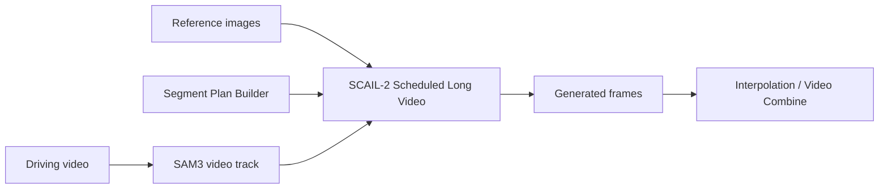
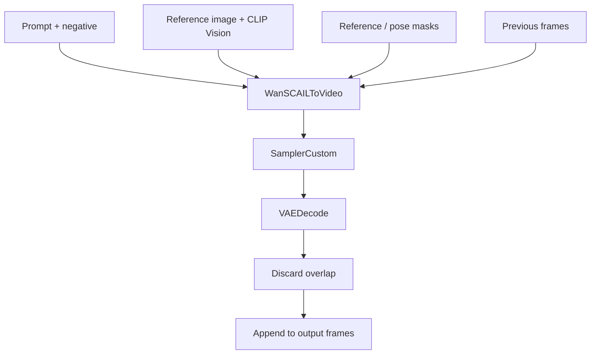

# ComfyUI SCAIL2 Scheduled Long Video

Multi-reference, multi-prompt scheduling for ComfyUI SCAIL2 long-video workflows.

This custom node package wraps the native SCAIL2 long-video pattern into a cleaner scheduler:

- split a long video into planned segments;
- assign each segment its own prompt and reference image;
- keep native SCAIL2 chunking under the recommended 81-frame window;
- preserve continuation with `previous_frames`;
- optionally reduce cross-reference inertia with `boundary_overlap`;
- provide dynamic UI controls for segment and reference counts.


## Nodes

### SCAIL-2 Segment Plan Builder

Use this node to create a segment plan without hand-writing JSON.

Each segment has:

- `frames`: final frame count for this segment;
- `reference`: which `reference_N` image to use;
- `prompt`: positive prompt for the segment;
- `negative`: negative prompt for the segment;
- `boundary_overlap`: optional overlap override for the first chunk after a reference change.

Set `segment_count`, then click `Update segment inputs` to hide unused segment controls.

### SCAIL-2 Scheduled Long Video

Runs the scheduled generation by repeatedly calling native ComfyUI SCAIL2 nodes internally.

Set `reference_count`, then click `Update reference inputs` to hide unused `reference_N` inputs.

### SCAIL-2 Segment Planner

Debug/helper node. It prints the resolved segment and chunk plan before generation.

## Workflow



Inside each chunk:



## Segment Planning

Recommended UI path:

1. Add `SCAIL-2 Segment Plan Builder`.
2. Set `segment_count`.
3. Fill the visible segment controls.
4. Connect `segment_plan` to `SCAIL-2 Scheduled Long Video.segment_plan`.

Example plan generated by the builder:

```text
# frames | reference | prompt | negative | boundary_overlap
77 | 1 | character enters the room wearing a coat | |
141 | 2 | character removes the coat, inner clothes visible | | 1
```

Meaning:

- frames `1-77` use `reference_1`;
- frames `78-218` use `reference_2`;
- the transition into `reference_2` uses `boundary_overlap = 1`.

## Boundary Overlap

`overlap_frames` is the global continuation overlap in video/image frames.

For stable same-reference continuation, `5` is a good default.

For a reference change, `boundary_overlap` can override the global value for the first chunk of the new segment:

| Value | Behavior |
| --- | --- |
| `-1` | Use global `overlap_frames` |
| `0` | No previous-frame anchor at the boundary |
| `1` | Minimal continuity, faster reference switch |
| `5` | Strong continuity, slower reference switch |

There is intentionally no `reference_strength` control. SCAIL2 does not expose a true reference-weight input. Pixel-blending a reference image into `previous_frames` can create static-image ghosting, so this package uses overlap control instead.

## Installation

Copy this folder into ComfyUI `custom_nodes`:

```text
ComfyUI/custom_nodes/scail_multi_cond
```

Restart ComfyUI.

If the dynamic UI buttons do not appear, hard-refresh the browser page. The package includes:

```text
web/js/scail_multi_cond_dynamic.js
```

The browser console should show:

```text
[SCAIL Multi Cond] dynamic UI extension loaded
```

## Requirements

This package expects a recent ComfyUI build that includes:

- `WanSCAILToVideo`;
- `SCAIL2ColoredMask`;
- `SAM3_VideoTrack`;
- `SamplerCustom`;
- `VAEDecode`;
- `ColorTransfer`.

The package itself does not depend on KJNodes. A workflow may still require KJNodes if it uses unrelated KJNodes nodes such as resize helpers.

## Included Workflows

```text
workflow/SCAIL2_scheduled_long_video_template.json
workflow/SCAIL2_long_video_sample.json
```

The sample workflow uses placeholder media names such as:

```text
your_driving_video.mp4
reference_1.png
reference_2.png
```

Replace them with your own ComfyUI input files.

## Recommended Settings

For SCAIL2 long video:

```text
max_chunk_frames = 81
overlap_frames = 5
```

For reference changes:

```text
boundary_overlap = 0 or 1
```

For same-reference continuation:

```text
boundary_overlap = -1
```

## Privacy

This repository does not include model files, generated videos, input images, private paths, or uploaded media.
