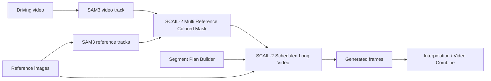
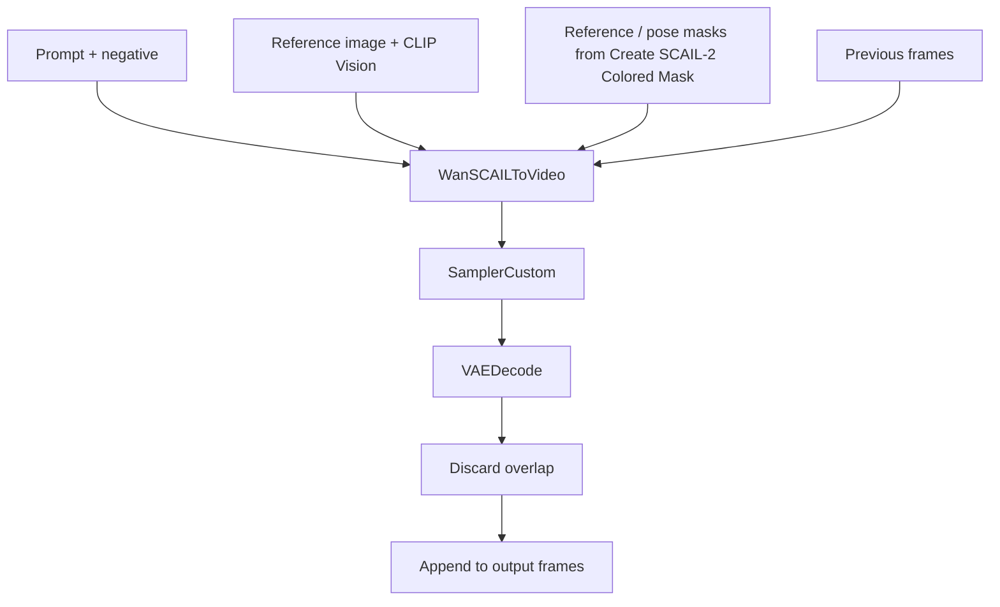

# ComfyUI SCAIL2 Scheduled Long Video

Multi-reference, multi-prompt scheduling for ComfyUI SCAIL2 long-video workflows.

This custom node package wraps the native SCAIL2 long-video pattern into a cleaner scheduler:

- split a long video into planned segments;
- assign each segment its own prompt and reference image;
- keep native SCAIL2 chunking under the recommended 81-frame window;
- preserve continuation with `previous_frames`;
- optionally reduce cross-reference inertia with `boundary_overlap`;
- provide dynamic UI controls for segment and reference counts.


## Nodes

### SCAIL-2 Segment Plan Builder

Use this node to create a segment plan without hand-writing JSON.

Each segment has:

- `frames`: final frame count for this segment;
- `reference`: which `reference_N` image to use;
- `prompt`: positive prompt for the segment;
- `negative`: negative prompt for the segment;
- `boundary_overlap`: optional overlap override for the first chunk after a reference change.

Set `segment_count`, then click `Update segment inputs` to hide unused segment controls.

### SCAIL-2 Scheduled Long Video

Runs the scheduled generation by repeatedly calling native ComfyUI SCAIL2 nodes internally.

Set `reference_count`, then click `Update reference inputs` to hide unused `reference_N` inputs.
The same button also updates the matching `reference_N_mask` inputs.

Recommended replacement setup:

```text
driving_track_data + reference_N_track_data -> SCAIL-2 Multi Reference Colored Mask
                                            -> pose_video_mask + reference_N_mask
```

Connect one shared `pose_video_mask` to the scheduler and connect each segment
reference to its matching `reference_N_mask`. The scheduler does not run SAM
internally; person selection stays in upstream SAM tracking and the multi-mask
helper where it can be previewed.

The node also outputs `used_pose_video_mask` and `used_reference_mask_timeline`.
Both are aligned to the final generated frame timeline after chunk overlap is
discarded, so they can be previewed beside the generated video.

### SCAIL-2 Scheduled Long Video (Internal SAM)

Convenience version of the scheduler. It keeps the same segment/chunk/video
generation logic as `SCAIL-2 Scheduled Long Video`, but builds the masks inside
the node:

```text
pose_video + sam_model + sam_conditioning -> internal SAM3 driving track
reference_N + sam_model + sam_conditioning -> internal SAM3 reference tracks
tracks -> native SCAIL-2 colored masks -> scheduled long video generation
```

Use this node when you want a simpler workflow. Use the external-mask scheduler
when you want to preview or manually adjust SAM tracks/masks before generation.
In `animation` mode, the node skips internal SAM tracking because SCAIL
replacement masks are not used; `sam_model` and `sam_conditioning` are only
required for `replacement` mode.

The internal SAM node supports:

- `object_indices`: driving-video object indices after sorting;
- `reference_object_indices`: reference-image object indices, empty = all;
- `sort_by`: `none`, `left_to_right`, or `area`;
- SAM controls: detection threshold, max objects, detect interval.

For single-person reference images, keep `reference_object_indices` empty. If
you fill `object_indices = 1` to select the second person in the driving video
and the reference image only has one person, also filtering the reference by `1`
would make the reference mask empty.

### SCAIL-2 Face Detail Refinement

Adds a second-pass face refinement path without replacing either long-video
scheduler. The intended workflow is:

```text
SCAIL-2 Scheduled Long Video / Internal SAM.frames  # full-body pass
  -> SCAIL-2 Head Track Crop
  -> SCAIL-2 Scheduled Long Video / Internal SAM    # face crop pass
  -> SCAIL-2 Face Composite Back
  -> VHS_VideoCombine
```

`SCAIL-2 Head Track Crop` crops a stable square head video from the generated
full-body frames. Connect a `head_masks` MASK when available. If your ComfyUI
build exposes SAM3 tracking, you can instead connect `sam_model` and
`head_conditioning`. The node first tries to extract the SAM3 face/head mask from
that conditioned track data, then falls back only to ComfyUI nodes that output a
regular `MASK`. It does not use SCAIL colored-mask fallback for face detail
cropping. If SAM returns a full-body or upper-body mask, the crop node estimates
the head box from the top of that tracked region instead of using the whole body
box, which keeps 9:16 full-body videos cropped around the face.
The output `face_crop_video` is the square face-neighborhood crop. The output
`crop_masks` is constrained to the detected face/head box inside that square,
and `crop_manifest.frames[].bbox` records the square's full-body paste position
while `crop_manifest.frames[].mask_bbox` records the tighter face/head mask
position. The crop size is fixed from the first tracked frame after padding and
stored as `crop_manifest.fixed_crop_size`; later frames move that same absolute
pixel square instead of resizing per-frame crops. For full-body 9:16 videos,
start with `crop_padding_ratio` around `0.35` to `0.5`.

`crop_mode` controls how the square crop is placed:

- `center_follow`: keeps the crop size fixed from the first tracked frame, then
  follows the face center frame by frame.
- `fixed_canvas`: computes the smallest padded square that covers the tracked
  face/head region across the whole clip, then uses that same fixed full-body
  bbox for every frame. Use this when the second pass should refine a stable
  local camera region while the head moves inside it. Obvious oversized head
  bbox outliers are ignored when building this canvas so a single SAM miss does
  not expand the crop to the upper body.

For the face crop pass, use either existing long-video scheduler:

- external-mask scheduler if you want to preview/adjust masks;
- internal-SAM scheduler if you want the crop video tracked inside the node.

Connect `face_crop_video` to the second scheduler's `pose_video`, and reuse the
same `segment_plan`, `max_chunk_frames`, `overlap_frames`, and
`boundary_overlap` settings as the full-body pass. Connect high-resolution face
references to `reference_N`; if the whole clip should use one face, point every
segment at reference `1`.

`SCAIL-2 Face Composite Back` pastes the refined crop back into the original
full-body frames using the crop manifest and mask. `color_correction` can be
enabled or disabled. When enabled, `local_mean_std` matches the refined face
crop to the target paste area before feather blending; when disabled, the node
only blends by mask. `face_fit_mode` controls how refined face frames whose
resolution changed are matched back to the manifest bbox: `center_crop` keeps
aspect ratio and crops the center, `pad` keeps aspect ratio and pads, and
`stretch` directly resizes to the bbox.

### SCAIL-2 Multi Reference Colored Mask

Builds SCAIL-2 colored masks for multiple reference tracks in one place.

Connect one `driving_track_data`, set `reference_count`, and connect
`reference_N_track_data` inputs. The node calls the native SCAIL-2 colored-mask
logic for each connected reference and outputs:

- `pose_video_mask`;
- dynamic `reference_N_mask` outputs matching `reference_count`.

Set `reference_count`, then click `Update reference track inputs` to hide unused
track-data inputs and mask outputs.

The node keeps the native `Create SCAIL-2 Colored Mask` controls:

- `object_indices`: comma-separated object indices such as `0,2`; empty means all;
- `sort_by`: `none`, `left_to_right`, or `area`.

These settings are applied to both driving and reference tracks before the masks
are rendered, matching the official SCAIL-2 behavior.

### SCAIL-2 Segment Planner

Debug/helper node. It prints the resolved segment and chunk plan before generation.

### SCAIL-2 Chunk Keyframe Extractor

Pre-processing helper for extracting frames from a loaded reference/action video
before generation. Use it when you want to build manually aligned reference
images for chunk boundaries.

Modes:

- `planner_summary`: connect `SCAIL-2 Segment Planner.summary`; the extractor
  follows the exact resolved chunk plan;
- `standard_long_video`: no planner input required; the extractor derives
  chunk boundaries from the video length, `max_chunk_frames`, and
  `overlap_frames`.

`contact_sheet_columns` and `contact_sheet_thumbnail_width` control the labeled
browser sheet layout.

Outputs:

- `boundary_anchor_frames`: the first frame, then each continued chunk's
  previous kept-frame anchor. Use these when aligning reference structure to
  the old video boundary;
- `new_chunk_start_frames`: the first final frame owned by each chunk;
- `paired_keyframes`: original-size keyframes in the same visual order as the
  browser sheet, alternating boundary/start pairs;
- `contact_sheet`: one labeled table image for preview only. It uses resized
  thumbnails and text labels, so use `paired_keyframes` when saving usable
  source images;
- `summary`: JSON with zero-based indices, one-based frame numbers, chunk
  ranges, and the safe continued keep size.

### SCAIL-2 Keyframe Matrix Viewer

Output/frontend node for browsing extracted keyframes as a clickable matrix.
Connect `SCAIL-2 Chunk Keyframe Extractor.paired_keyframes` and `summary` to
this node. When it runs, it saves each original-size keyframe as an individual
PNG and renders a labeled matrix in the node UI.

Each matrix cell shows the chunk/type/frame metadata and links to the original
PNG with `Open`, `Download`, and `Copy URL` actions. This is different from
`contact_sheet`, which is only a rendered preview image.

## Workflow



Inside each chunk:



## Segment Planning

Recommended UI path:

1. Add `SCAIL-2 Segment Plan Builder`.
2. Set `segment_count`.
3. Fill the visible segment controls.
4. Connect `segment_plan` to `SCAIL-2 Scheduled Long Video.segment_plan`.

Example plan generated by the builder:

```text
# frames | reference | prompt | negative | boundary_overlap
77 | 1 | character enters the room wearing a coat | |
141 | 2 | character removes the coat, inner clothes visible | | 1
```

Meaning:

- frames `1-77` use `reference_1`;
- frames `78-218` use `reference_2`;
- the transition into `reference_2` uses `boundary_overlap = 1`.

## Boundary Overlap

`overlap_frames` is the global continuation overlap in video/image frames.

For stable same-reference continuation, `5` is a good default.

For a reference change, `boundary_overlap` can override the global value for the first chunk of the new segment:

| Value | Behavior |
| --- | --- |
| `-1` | Use global `overlap_frames` |
| `0` | No previous-frame anchor at the boundary |
| `1` | Minimal continuity, faster reference switch |
| `5` | Strong continuity, slower reference switch |

There is intentionally no `reference_strength` control. SCAIL2 does not expose a true reference-weight input. Pixel-blending a reference image into `previous_frames` can create static-image ghosting, so this package uses overlap control instead.

When planning chunks manually, remember that `max_chunk_frames` is the full
native generation window, including overlap frames. If `max_chunk_frames=81`
and `overlap_frames=5`, a continued chunk can only keep `76` new frames before
another chunk is required. Segment lengths near the full chunk size can create
tiny follow-up chunks, such as `81 -> 76 + 5`. Use `max_chunk_frames -
overlap_frames` as the safe boundary for ordinary continued segments. For the
first chunk after a reference change, use that segment's `boundary_overlap`
instead of the global overlap when calculating the boundary.

In `SCAIL-2 Chunk Keyframe Extractor.standard_long_video` mode, the same rule
is used. With `max_chunk_frames=81` and `overlap_frames=5`, boundary anchors
progress as `1, 81, 157, 233...`, not `1, 81, 162...`.

## Installation

Copy this folder into ComfyUI `custom_nodes`:

```text
ComfyUI/custom_nodes/scail_multi_cond
```

Restart ComfyUI.

If the dynamic UI buttons do not appear, hard-refresh the browser page. The package includes:

```text
web/js/scail_multi_cond_dynamic.js
```

The browser console should show:

```text
[SCAIL Multi Cond] dynamic UI extension loaded
```

## Requirements

This package expects a recent ComfyUI build that includes:

- `WanSCAILToVideo`;
- `SamplerCustom`;
- `VAEDecode`;
- `ColorTransfer`.

Replacement workflows should use upstream ComfyUI nodes such as `SAM3_VideoTrack`
and `SCAIL-2 Multi Reference Colored Mask` to prepare `pose_video_mask` and
`reference_N_mask` before this scheduler node.

The package itself does not depend on KJNodes. A workflow may still require KJNodes if it uses unrelated KJNodes nodes such as resize helpers.

## Included Workflows

```text
workflow/SCAIL2_scheduled_long_video_template.json
workflow/SCAIL2_long_video_sample.json
workflow/comfyui_scail2_multi_cond_sample_external.json
workflow/comfyui_scail2_multi_cond_sample_internal.json
```

The sample workflow uses placeholder media names such as:

```text
your_driving_video.mp4
reference_1.png
reference_2.png
reference_3.png
```

Replace them with your own ComfyUI input files.

## Recommended Settings

For SCAIL2 long video:

```text
max_chunk_frames = 81
overlap_frames = 5
```

For reference changes:

```text
boundary_overlap = 0 or 1
```

For same-reference continuation:

```text
boundary_overlap = -1
```

## Privacy

This repository does not include model files, generated videos, input images, private paths, or uploaded media.
